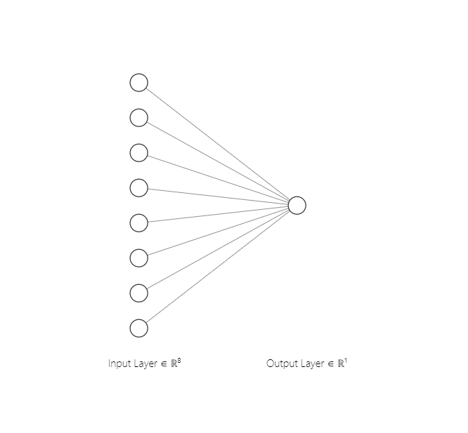
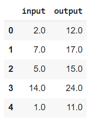
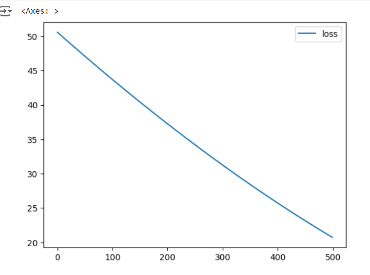
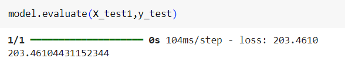
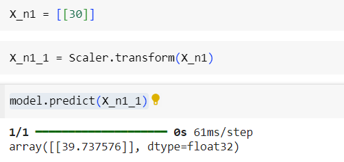

# Developing a Neural Network Regression Model

## AIM

To develop a neural network regression model for the given dataset.

## THEORY

First, load your data and Then, clean it up by handling any missing values and scaling the features so they’re all on a similar range. Split your data into training and testing sets.

Next, design your neural network by choosing how many layers and neurons you want. Then, write the code to create this network using a library like TensorFlow or PyTorch. Train the model using your training data.

After training, test the model with your testing data to see how well it performs. Fine-tune the model if needed, adjusting parameters and re-training until you're satisfied with its performance. Finally, evaluate the model’s performance using metrics appropriate for regression, like Mean Squared Error or R-squared.

## Neural Network Model



## DESIGN STEPS

### STEP 1:

Loading the dataset

### STEP 2:

Split the dataset into training and testing

### STEP 3:

Create MinMaxScalar objects ,fit the model and transform the data.

### STEP 4:

Build the Neural Network Model and compile the model.

### STEP 5:

Train the model with the training data.

### STEP 6:

Plot the performance plot

### STEP 7:

Evaluate the model with the testing data.

## PROGRAM
### Name: Shaik Shoaib Nawaz
### Register Number: 212222240094
```python
import pandas as pd
from sklearn.model_selection import train_test_split
from sklearn.preprocessing import MinMaxScaler
from tensorflow.keras.models import Sequential
from tensorflow.keras.layers import Dense
from google.colab import auth
import gspread
from google.auth import default
auth.authenticate_user()
creds, _ = default()
gc = gspread.authorize(creds)
worksheet = gc.open('Deep_NN_model_dataset').sheet1
data = worksheet.get_all_values()
dataset1 = pd.DataFrame(data[1:], columns=data[0])
dataset1 = dataset1.astype({'input':'float'})
dataset1 = dataset1.astype({'output':'float'})
dataset1.head()
X = dataset1[['input']].values
y = dataset1[['output']].values
X
X_train,X_test,y_train,y_test = train_test_split(X,y,test_size = 0.33,random_state = 33)
Scaler = MinMaxScaler()
Scaler.fit(X_train)
X_train1 = Scaler.transform(X_train)
from tensorflow.keras import layers
from tensorflow.keras import models
model=models.Sequential([
    layers.Dense(8,activation='relu',input_shape=[1]),
    layers.Dense(1)
])
model.compile(optimizer='rmsprop',loss='mse')
model.fit(X_train1,y_train,epochs=500)
loss_df = pd.DataFrame(model.history.history)
loss_df.plot()
X_test1 = Scaler.transform(X_test)
model.evaluate(X_test1,y_test)
X_n1 = [[30]]
X_n1_1 = Scaler.transform(X_n1)
model.predict(X_n1_1)


```
## Dataset Information



## OUTPUT

### Training Loss Vs Iteration Plot



### Test Data Root Mean Squared Error



### New Sample Data Prediction



## RESULT
Thus a neural network regression model for the given dataset is developed successfully.

